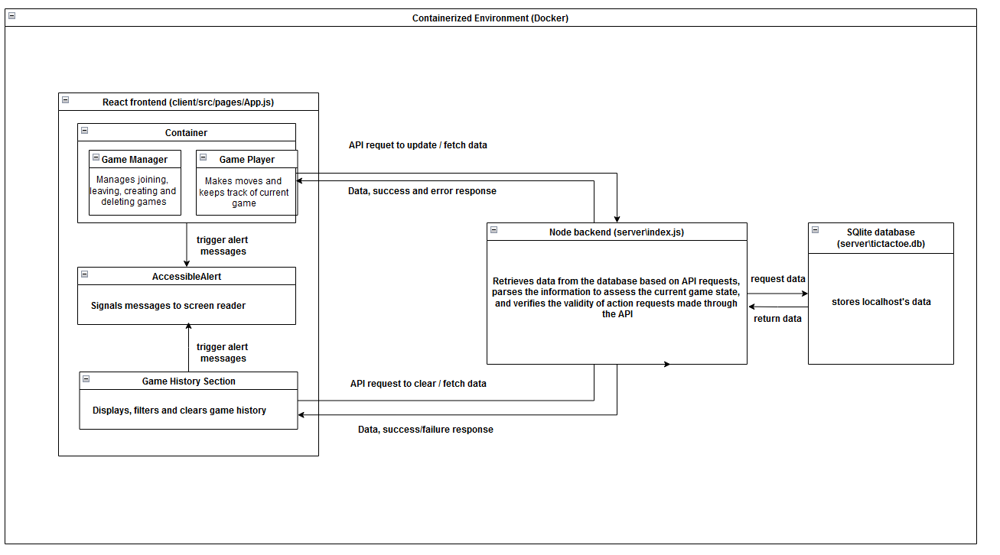

## About AccessibleT3, design decisions and accessibility considerations

The AccessibleT3 project is built with React, Node.js, and SQLite, and is containerized with Docker for easy deployment. It is designed to create an inclusive, fully accessible experience for all players, especially those using screen readers. To ensure accessibility, I prioritized sequential readability, arranging all elements on a single page to simplify navigation for screen readers. There are 3 components, side bar for managing all games, main bar for playing the current game, and game history section to view past games. These components are neatly divided and documented for easier navigation. Key game actions—including setting player names, creating, deleting, or joining games, and making moves—are accompanied by alerts that screen readers announce, ensuring players receive timely feedback for each action. Error messages are also announced, guiding users through potential issues like invalid moves, attempts to access the board without joining a game, or incorrect confirmation inputs.

The interface uses clear, descriptive text throughout to help players easily track game progress, while concise labels and straightforward design support efficient interaction. These accessibility-first design choices ensure a smooth, responsive experience, keeping AccessibleT3 inclusive and user-friendly for all players.

## [List of Apis](https://www.postman.com/cryosat-saganist-18028673/fc263974-3b6b-455a-b86c-1c780628d8a2/request/jcsqgny/clearing-all-ended-game-history)

## [Walkthrough/testing video](https://drive.google.com/file/d/1IaAzo_Ez4bzg_10e7B22PURuYu8fTAuw/view?usp=sharing)

## Architecture diagram



# Set Up Guide for AccessibleT3

This guide will help you set up the AccessibleT3 project on your local machine. Please follow each step carefully.

## Prerequisites

Before you begin, ensure you have the following software installed on your device using your terminal:

1. **Docker**:

   - Follow the official installation instructions for your operating system:
     - **[Docker Desktop for Windows](https://docs.docker.com/desktop/install/windows-install/)**
     - **[Docker Desktop for Mac](https://docs.docker.com/desktop/install/mac-install/)**
     - **[Docker Engine for Linux](https://docs.docker.com/engine/install/)**
   - After installation, verify that Docker is working by running the following command in your terminal or command prompt:
     ```bash
     docker --version
     ```

2. **Git**:
   - Install Git from the official website:
     - **[Download Git](https://git-scm.com/downloads)**
   - Verify the installation by running:
     ```bash
     git --version
     ```

## Clone the Project

1. Open your terminal or command prompt.

2. Choose a directory where you want to clone the project. For example, you can navigate to your `Documents` folder:

   ```bash
   cd Documents
   ```

3. Clone the project repository by executing the following command:

   ```bash
   git clone https://github.com/Kokseng1/AccessibleT3
   ```

4. After cloning, navigate into the project directory:
   ```bash
   cd AccessibleT3
   ```

## Build and Run the Application

1. Ensure that Docker is running. You can check this by looking for the Docker icon in your system tray or taskbar.

2. Build and start the application using Docker Compose with the following command (you might need to run command line with administrative rights):

   ```bash
   docker-compose up --build
   ```

   The terminal will display logs from the application, which can help in troubleshooting if needed.

3. Wait for the process to complete. Once you see output indicating that the application is up and running, you can access the application in your web browser.

## Access the Game

1. Open your web browser and navigate to:
   </br> `http://localhost:3000`
2. Use different browsers (like Chrome and Firefox) or incognito/private mode in your browser to simulate multiple players to test multiplayer functionality:
